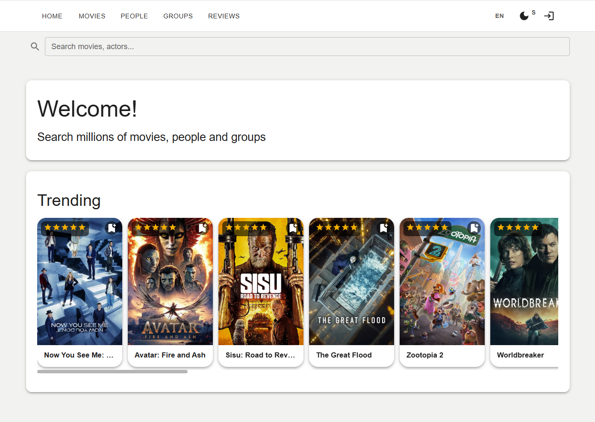

## MovieApp

**This project is under active development.**  
Learning project – Fullstack  
Link to application: *upcoming*



Web application for movie enthusiasts.  
Users can browse movies, write reviews, join groups, search showtimes, and manage favorites.  
The application integrates with **The Movie Database (TMDB)** API.

The project emphasizes **contract-driven and test-driven development**, with a strong focus on data modeling and explicit system behavior.

---

## Project Goal

The primary goal of this project is to develop my system design and software engineering skills through hands-on, production-oriented learning.

Rather than focusing on rapid feature delivery, the emphasis is on:
- clear API contracts
- explicit data and error flows
- predictable and testable behavior
- maintainable backend architecture

---

## Key Learnings

The most significant shift during this project was moving from *implementation-first* thinking to a **data-first and contract-first approach**.

Core principles applied:
- Design behavior before implementation
- Treat APIs as explicit contracts
- Use tests to enforce specifications
- Separate happy paths and error paths explicitly

### Development Process

The project follows this workflow consistently:

1. Design **data flows** and **error flows** using Mermaid and Markdown  
2. Define **Data Objects (DTOs)**  
3. Document decisions using **OpenAPI / Swagger**  
4. Define schemas with **Prisma** and **Zod**  
5. Write **spec-aligned tests**  
6. Implement the designed feature  

---


---

## API Documentation

OpenAPI / Swagger documentation is used as the primary contract for the backend API.  
Documentation is updated alongside feature development.

---

## Database

Database schema and relationships are defined using Prisma.  
Entity relationships and constraints are documented separately.

---

## Technologies

### Frontend
- React (Vite)
- React Router DOM
- TypeScript

### Backend
- Node.js
- Express
- Prisma
- Zod
- Vitest
- bcrypt
- jsonwebtoken
- cookie-parser
- dotenv
- nodemon

### Documentation & Tooling
- OpenAPI / Swagger
- Mermaid (data and error flows)
- dbdiagram.io
- GitHub

---

## Project Structure


## Project structure
```
MovieApp/
  client/            # React frontend
  server/            # Node/Express backend
  docs/              # data-flows, architectures
  .gitignore
  README.md
```