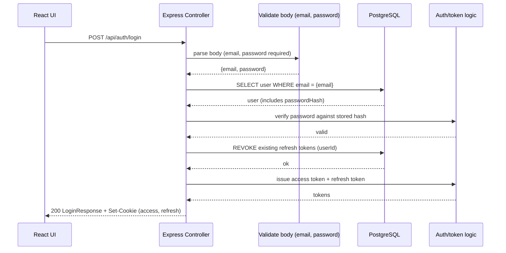

# Login Data flow

## Data objects

### UI Login (req.body)
 - email string
 - password string

### User (DB record)
  - id    integer
  - username    string
  - email       string
  - firstname   string
  - lastname    string
  - ownedGroups Group[]
  - groups      Group[]
  - refreshTokens RefreshToken[]
  - passwordHash   string

### Login response (JSON)
  - id    integer
  - username    string
  - email       string
  - firstname   string
  - lastname    string
  - ownedGroups Group[]
  - groups      Group[]
  - refreshTokens RefreshToken[]
  - passwordHash   string

### Auth cookies (Set-Cookie)
#### accessToken
 - type: opaque string / JWT
 - storage: httpOnly cookie
 - purpose: authenticated API requests
 - lifetime: short (minutes)

#### refreshToken
 - type: opaque string / JWT
 - storage: httpOnly cookie
 - purpose: access token renewal
 - lifetime: long (days / weeks)
 - server-side state: stored & revocable

### RefreshToken (DB record)
 - id: string | number
 - userId: number
 - revoked: boolean
 - createdAt: timestamp
 - expiresAt: timestamp 