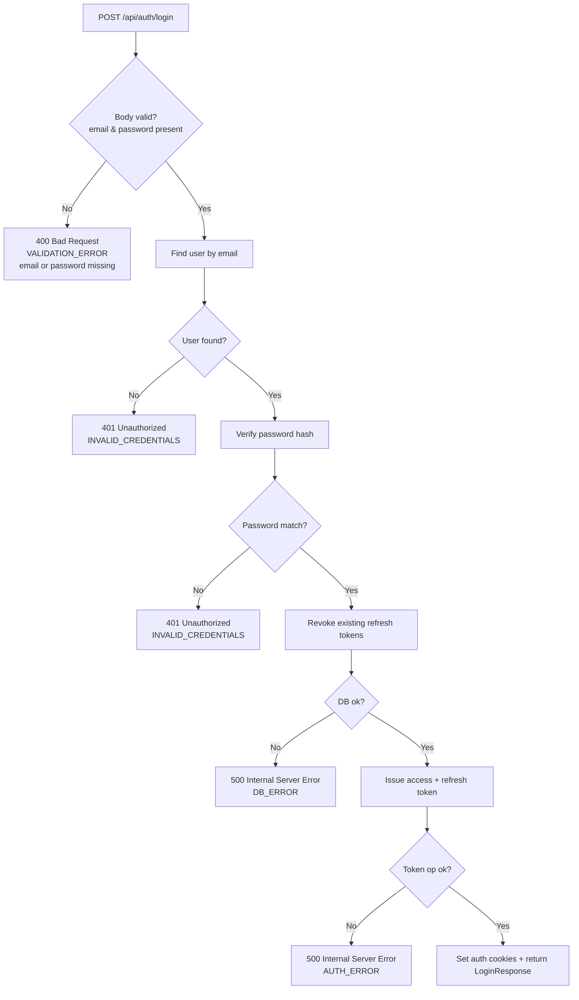

```mermaid
flowchart TD
  A[POST /api/auth/login] --> B{Body valid? \n email & password present}
  B -- No --> E400[400 Bad Request\nVALIDATION_ERROR\nemail or password missing]

  B -- Yes --> C[Find user by email]
  C --> D{User found?}
  D -- No --> E401A[401 Unauthorized\nINVALID_CREDENTIALS]

  D -- Yes --> E[Verify password hash]
  E --> F{Password match?}
  F -- No --> E401B[401 Unauthorized\nINVALID_CREDENTIALS]

  F -- Yes --> G[Revoke existing refresh tokens]
  G --> H{DB ok?}
  H -- No --> E500A[500 Internal Server Error\nDB_ERROR]

  H -- Yes --> I[Issue access + refresh token]
  I --> J{Token op ok?}
  J -- No --> E500B[500 Internal Server Error\nAUTH_ERROR]

  J -- Yes --> K[Set auth cookies + return LoginResponse]
```

## Error response conventions

### 400 
Returned when request body is not valid

### 401
Returned when credentials are invalid

### 500
Returned when database operation or token handling fails
