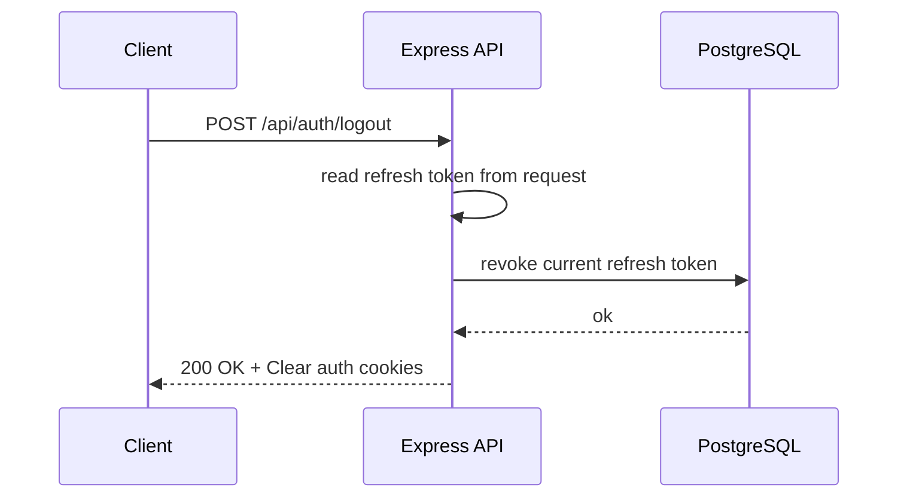

## Logout Data Flow

### Data object
#### refreshToken
 - type: opaque string / JWT
 - storage: httpOnly cookie
 - purpose: access token renewal
 - lifetime: long (days / weeks)
 - server-side state: stored & revocable