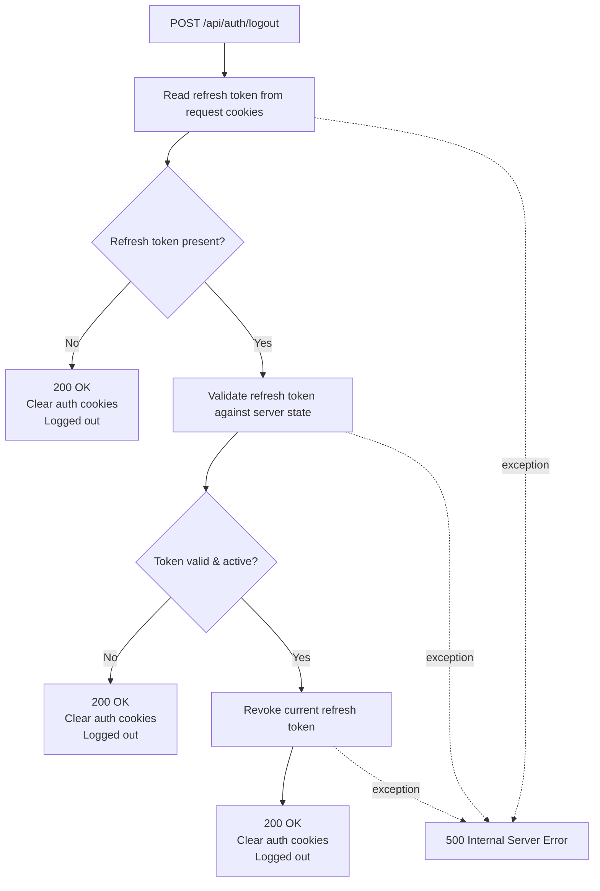

## Logout Error Flow

```mermaid
flowchart TD
  A[POST /api/auth/logout] --> C[Read refresh token from request cookies]
  C --> D{Refresh token present?}

  D -- No --> S200[200 OK<br/>Clear auth cookies<br/>Logged out]

  D -- Yes --> E[Validate refresh token against server state]
  E --> F{Token valid & active?}

  F -- No --> S200B[200 OK<br/>Clear auth cookies<br/>Logged out]

  F -- Yes --> G[Revoke current refresh token]
  G --> S200C[200 OK<br/>Clear auth cookies<br/>Logged out]

  C -. exception .-> E500[500 Internal Server Error]
  E -. exception .-> E500
  G -. exception .-> E500

```