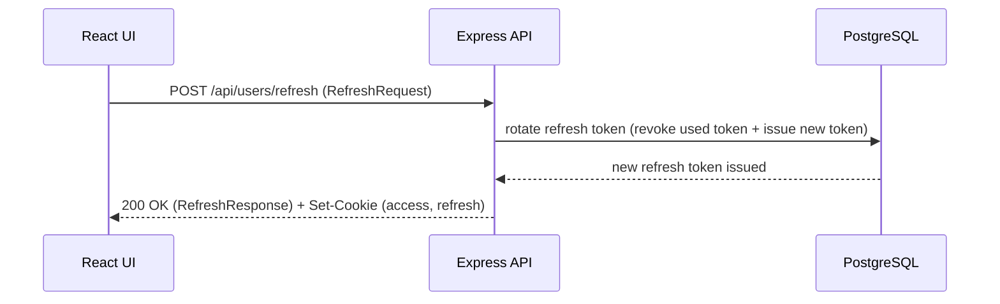

## Refresh Data Flow

### Data Objects
#### RefreshRequest
 - refreshToken: string (via httpOnly cookie)

##### RefreshResponse (200)
 - ok: boolean

#### Auth cookies (Set-Cookie)
 - accessToken: httpOnly cookie
 - refreshToken: httpOnly cookie (rotated)