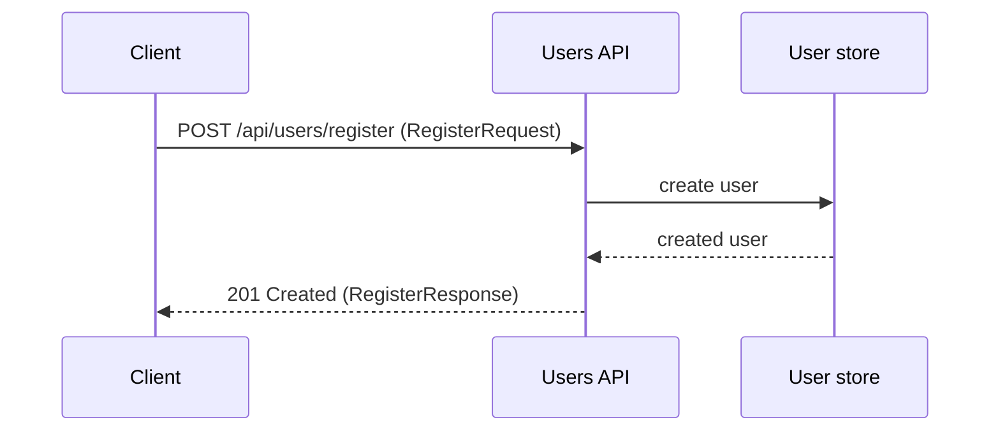

## Register Data Flow

```mermaid
sequenceDiagram
  participant UI as Client
  participant API as Users API
  participant DB as User store

  UI->>API: POST /api/users/register (RegisterRequest)
  API->>DB: create user
  DB-->>API: created user
  API-->>UI: 201 Created (RegisterResponse)
```

### Data Objects
#### RegisterRequest (req.body)
 - email: string
 - password: string

#### RegisterResponse (201)
 - id: number
 - email: string