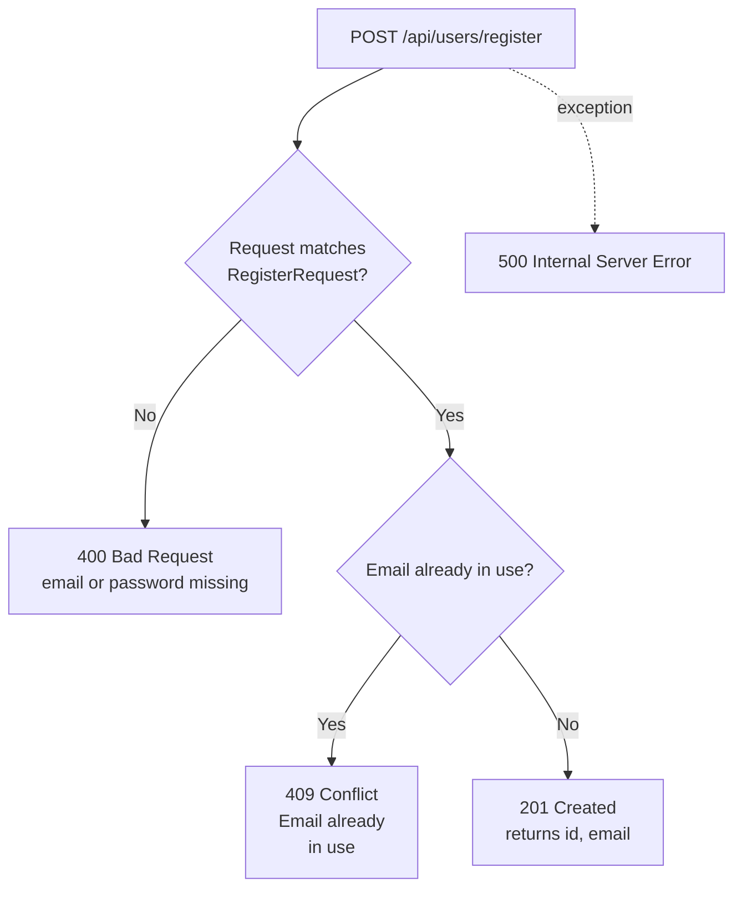

## Register Error Flow

```mermaid
flowchart TD
  A[POST /api/users/register] --> B{Request matches<br/>RegisterRequest?}

  B -- No --> E400[400 Bad Request<br/>email or password missing]

  B -- Yes --> C{Email already in use?}
  C -- Yes --> E409[409 Conflict<br/>Email already<br/>in use]

  C -- No --> S201[201 Created<br/>returns id, email]

  A -. exception .-> E500[500 Internal Server Error]
```