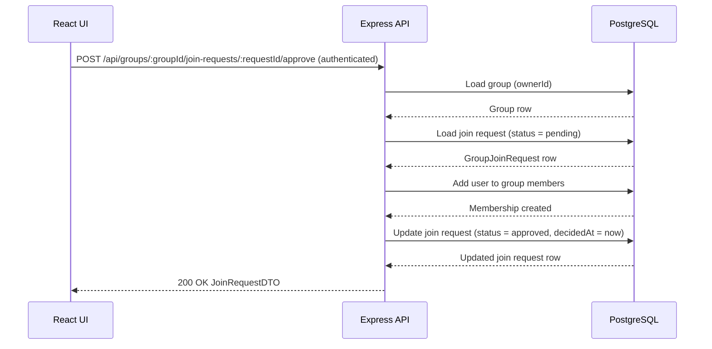

## POST /api/groups/{groupId}/join-requests/{requestId}/approve – Data Flow

## Data Objects
### Path Params
```ts
groupId: integer
requestId: integer
```
### Auth Context
```ts
auth.userId: integer
Authenticated requester id.
```
### GroupJoinRequest (Database Row)
```ts
id: integer
groupId: integer
userId: integer
status: "pending" | "approved" | "rejected"
createdAt: timestamp
decidedAt: timestamp | null
```
### Membership (on approve)

User from join request is added to group members<br>
Membership creation and request update are treated as one logical operation

### JoinRequestDTO (200 OK)
```ts
requestId: integer
groupId: integer
userId: integer
status: "approved"
createdAt: timestamp
decidedAt: timestamp
```