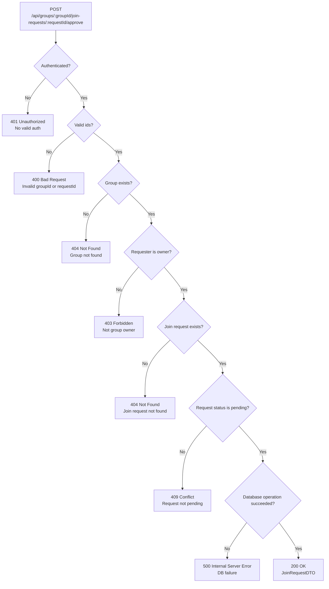

## POST /api/groups/{groupId}/join-requests/{requestId}/approve – Error Flow

## Error Conventions Response
### 400 Bad Request
Returned when groupId or requestId is invalid.

### 401 Unauthorized
Returned when the request is not authenticated.

### 403 Forbidden
Returned when the requester is not the group owner.

### 404 Not Found
Returned when the group or join request does not exist.

### 409 Conflict
Returned when the join request is not in pending state.

### 500 Internal Server Error
Returned when a database operation fails.

### 200 OK
Returned on success. Response body: JoinRequestDTO.