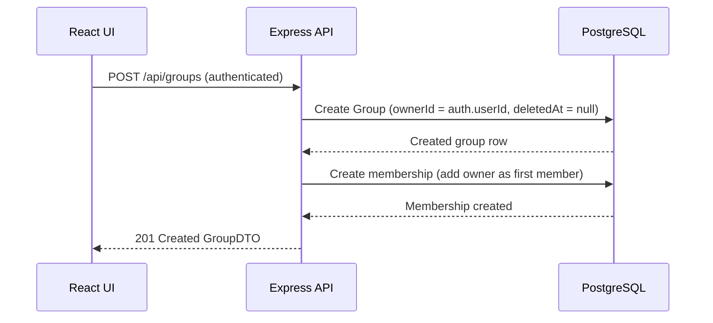

## POST /api/groups – Create Group Data Flow

## Path details
### Auth Context
```ts
auth.userId: integer
Authenticated requester id (from token/session)
```

### Membership (implicit on create)

Owner is automatically added as the first member
No other members are added during create
