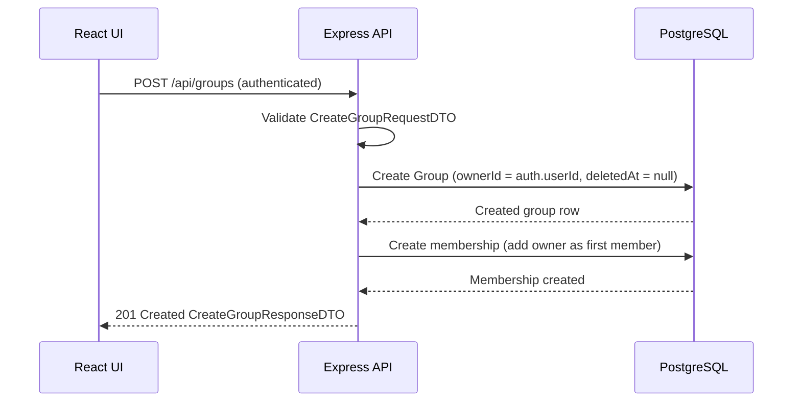

## POST /api/groups – Create Group Data Flow

## Data Objects
### CreateGroupRequestDTO (Request Body)
```ts
name: string
public: boolean
```

### Auth Context
```ts
auth.userId: integer
Authenticated requester id (from token/session)
```

### Database Group Row (created)
```ts
id: integer
name: string
ownerId: integer
public: boolean
createdAt: timestamp
updatedAt: timestamp
deletedAt: timestamp | null (must be null on create)
```

### Membership (implicit on create)

Owner is automatically added as the first member
No other members are added during create

### CreateGroupResponseDTO (201 Created)
```ts
groupId: integer
groupName: string
public: boolean
createdAt: timestamp
```