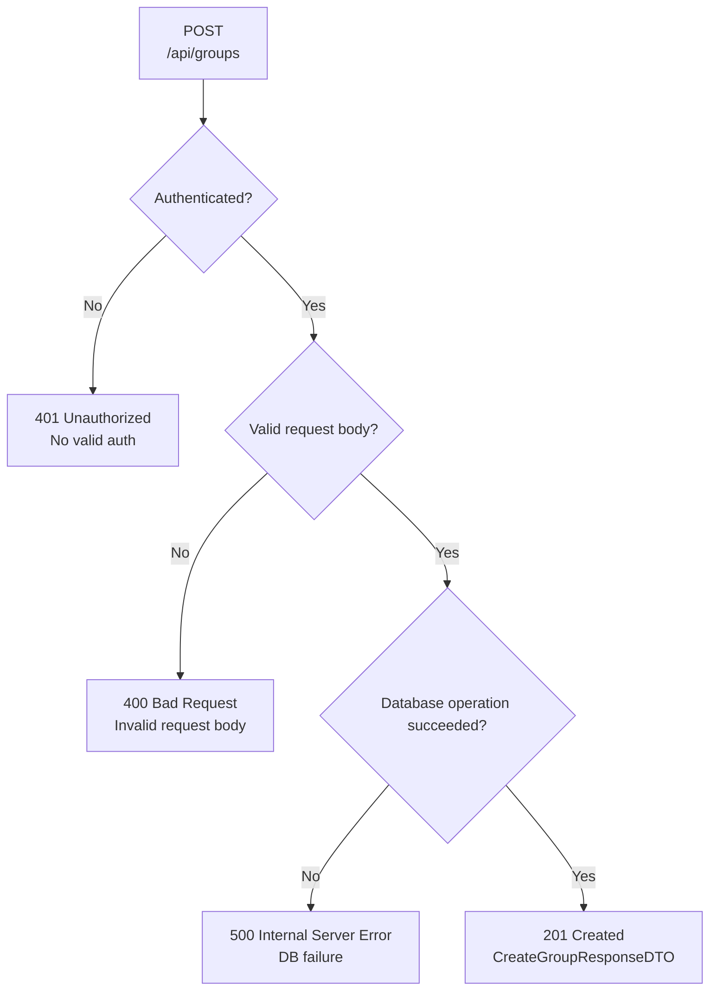

## POST /api/groups – Error Flow

## Error Response Conventions
### 400 Bad Request
Returned when the request body is invalid (e.g. missing or invalid name).

### 401 Unauthorized
Returned when the request is not authenticated.

### 201 Created
Returned on success. Response body: CreateGroupResponseDTO.

### 500 Internal Server Error
Returned when the database operation fails.