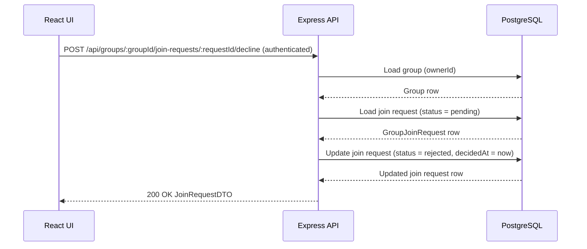

## POST /api/groups/{groupId}/join-requests/{requestId}/decline – Data Flow

## Path details
### Path Params
```ts
groupId: integer
requestId: integer
```
### Auth Context
```ts
auth.userId: integer
Authenticated requester id.
```