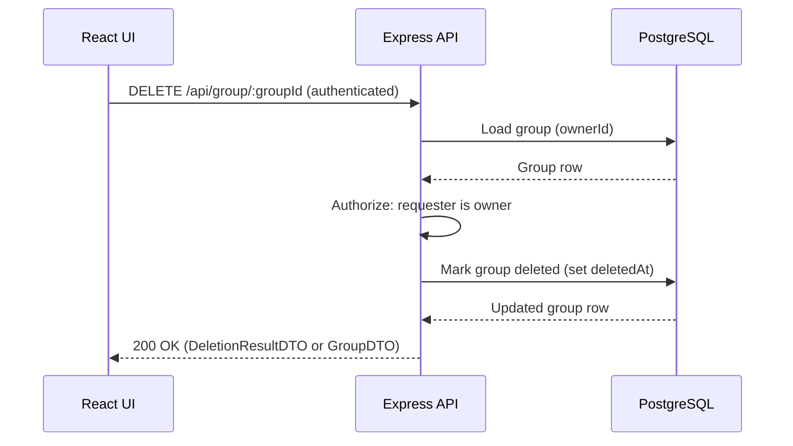

## DELETE /api/group/{groupId}



## Data Objects
### Path Params
```ts
- groupId: integer (Positive integer)
```
### Auth Context
```ts
auth.userId: integer
Authenticated requester id (from token/session).
```

### Database Group Row
```ts
- id: integer
- name: string
- ownerId: integer
- public: boolean
- createdAt: timestamp
- updatedAt: timestamp
- deletedAt: timestamp | null
```

### DeletionResultDTO
```ts
groupId: integer
deletedAt: timestamp
```
Alternative: Empty success response
If you return no body on success, document it explicitly:
```ts
Response body: empty
```