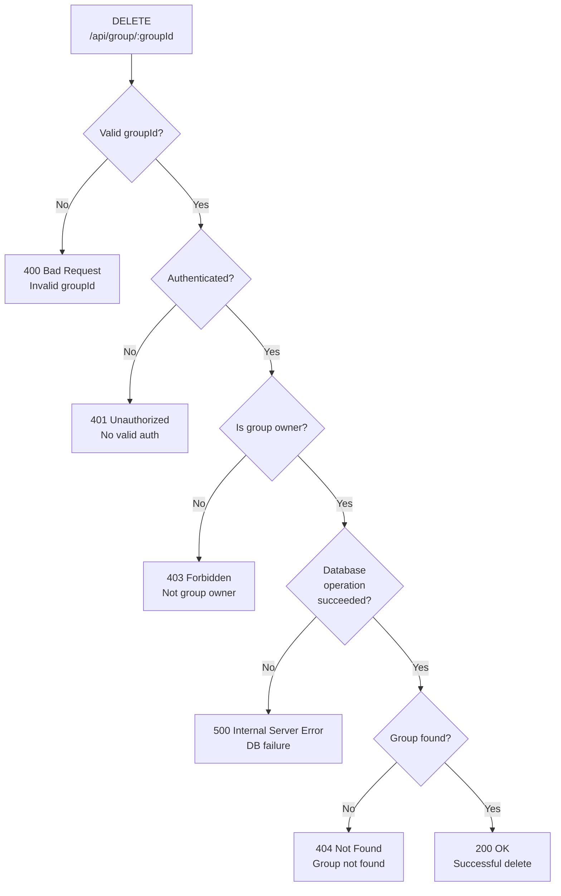

## DELETE /api/group/{groupId} - Error Flow

## Error Response Convention
### 400 Bad Request 
Invalid groupId

### 401 Unauthorized
No valid auth

### 403 Forbidden 
Requester is not the group owner

### 404 Not Found
Group does not exist (or is already deleted)

### 500 Internal Server Error
Database operation fails