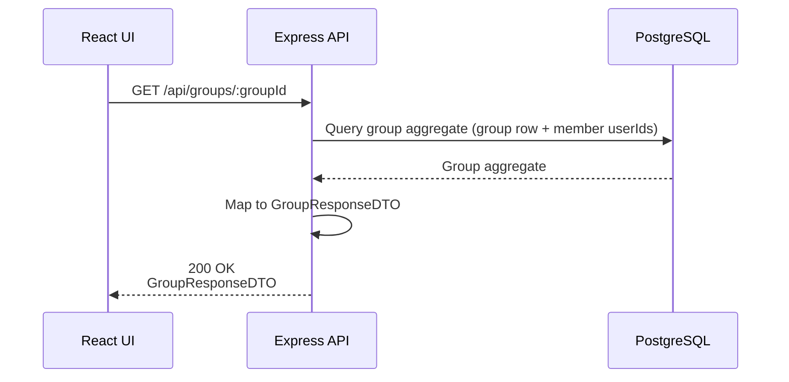

## GET /api/groups/{groupId} – Data Flow



### Data Objects

#### Database Group Row
```ts
- id: integer
- name: string
- ownerId: integer
- public: boolean
- createdAt: DateTime
- updatedAt: DateTime
- deletedAt: DateTime | null
```

#### GroupMembers (many-to-many)
```ts
- groupId: integer
- userId: integer
```

#### Group Response DTO
```ts
- groupId: integer
- groupName: string
- public: boolean
- members: integer[]
- createdAt: timestamp
```