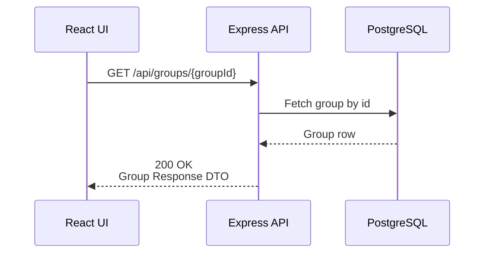

## ## GET /api/groups/{groupId} – Data Flow



### Data Objects

#### Database Row
```ts
- id: integer
- name: string
- ownerId: integer
- members: integer[]
- public: boolean
- createdAt: timestamp
- updatedAt: timestamp
- deletedAt: timestamp | null
```

#### Group Response DTO
```ts
- groupId: integer
- groupName: string
- members: integer[]
- createdAt: timestamp
```