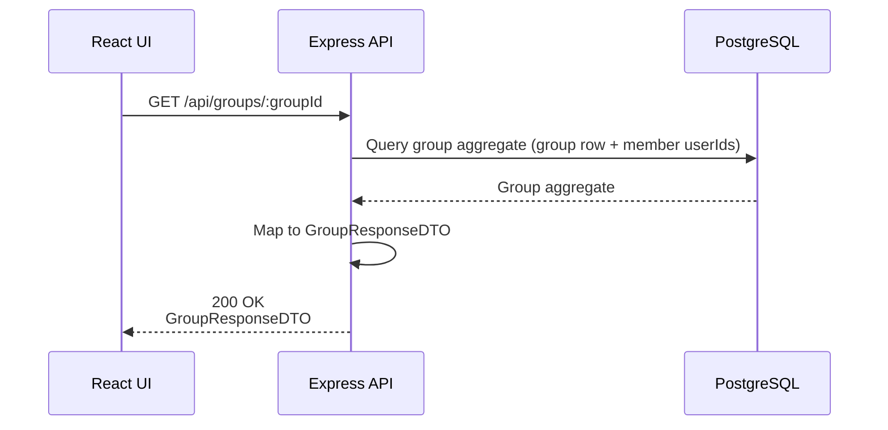

## GET /api/groups/{groupId} – Data Flow

```mermaid
sequenceDiagram
  participant UI as React UI
  participant API as Express API
  participant DB as PostgreSQL

  UI->>API: GET /api/groups/:groupId
  API->>DB: Query group aggregate (group row + member userIds)
  DB-->>API: Group aggregate
  API->>API: Map to GroupResponseDTO
  API-->>UI: 200 OK<br/>GroupResponseDTO
```