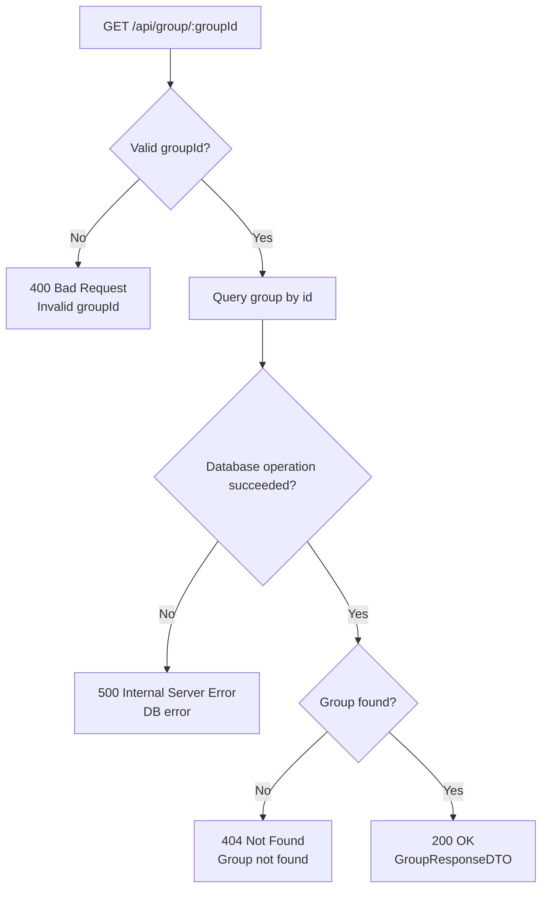

## GET /api/group/{groupId}

## Error Response Conventions
### 400 BAD REQUEST
Returned when groupId is not a positive integer.

### 404 NOT FOUND
Returned when no group exists with the requested groupId.

### 500 INTERNAL SERVER ERROR
Returned when database operations fail.

### 200 OK
Returned on success. Response body: GroupResponseDTO.
