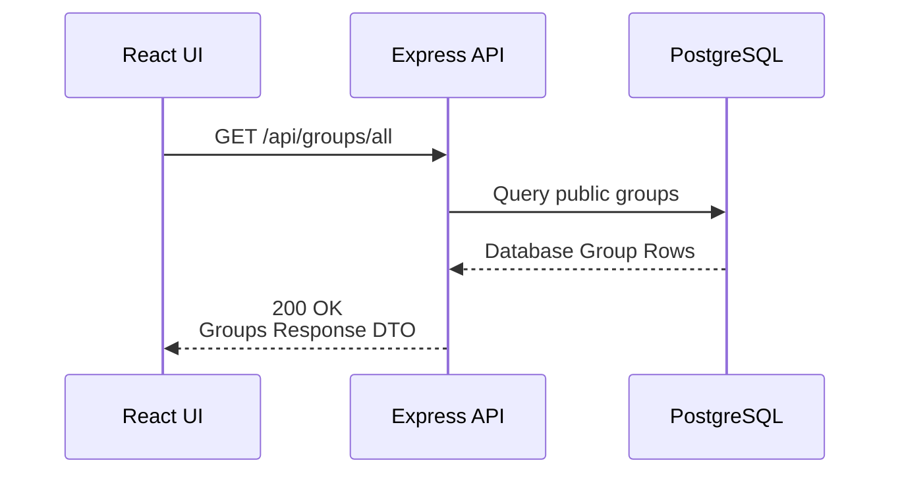

## GET /api/groups/all - Data Flow

```mermaid
sequenceDiagram
participant UI as React UI
participant API as Express API
participant DB as PostgreSQL

UI ->> API: GET /api/groups/all
API ->> DB: Query public groups
DB -->> API: Database Group Rows
API -->> UI: 200 OK<br>Groups Response DTO
```