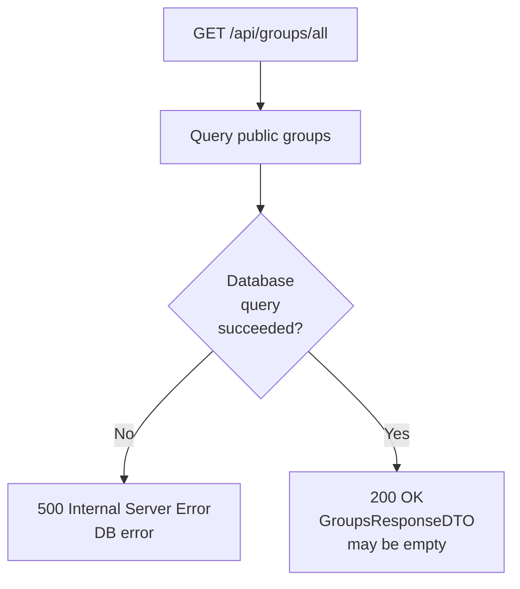

## GET /api/groups/all

## Error Response Conventions
### 200 OK
Returned on success. Response body: GroupsResponseDTO (array; may be empty).

### 500 Internal Server Error
Returned when database operations fail.