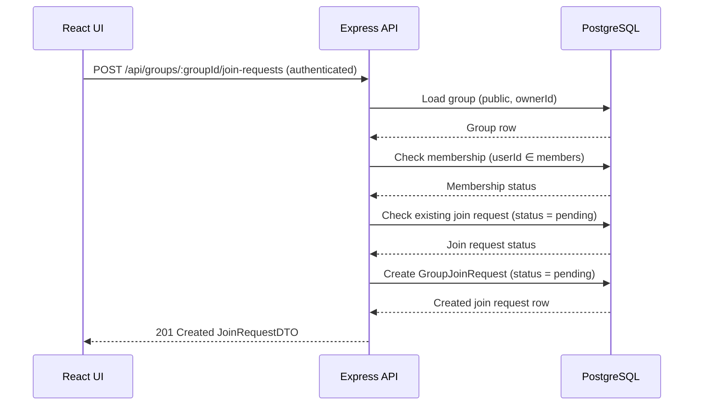

## POST /api/groups/{groupId}/join-requests – Data Flow


## Data Objects
### Path Params
groupId: integer 

### Auth Context
```ts
auth.userId: integer
```
Authenticated requester id.

### GroupJoinRequest (Database Row)
```ts
id: integer
groupId: integer
userId: integer
status: "pending" | "approved" | "rejected"
createdAt: timestamp
decidedAt: timestamp | null
```
### JoinRequestDTO (201 Created)
```ts
requestId: integer
groupId: integer
userId: integer
status: "pending"
createdAt: timestamp
```