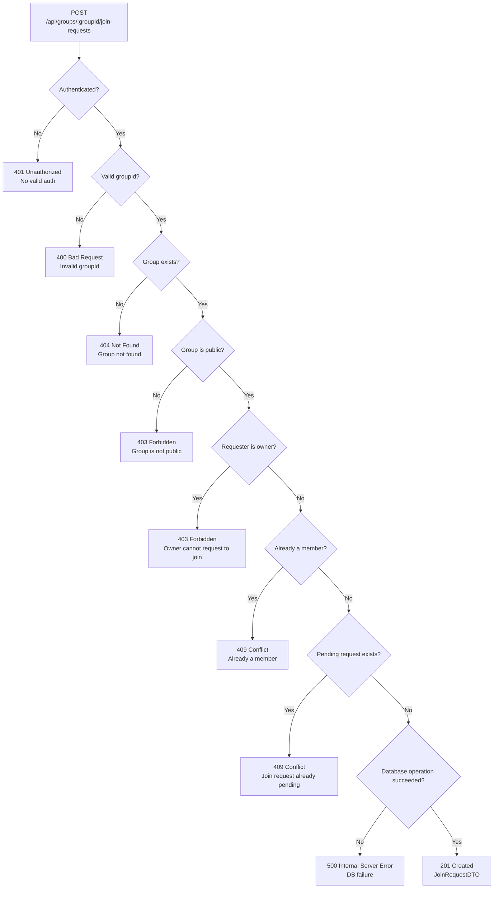

## POST /api/groups/{groupId}/join-requests – Error Flow

## Error Conventions Response
### 400 Bad Request
Returned when groupId is invalid.

### 401 Unauthorized
Returned when the request is not authenticated.

### 403 Forbidden
Returned when: 
the group is not public, or 
the requester is the group owner. 

### 404 Not Found
Returned when the group does not exist. 

### 409 Conflict
Returned when: 
the requester is already a group member, or 
a pending join request already exists. 

### 500 Internal Server Error
Returned when a database operation fails. 

### 201 Created
Returned on success. Response body: JoinRequestDTO. 