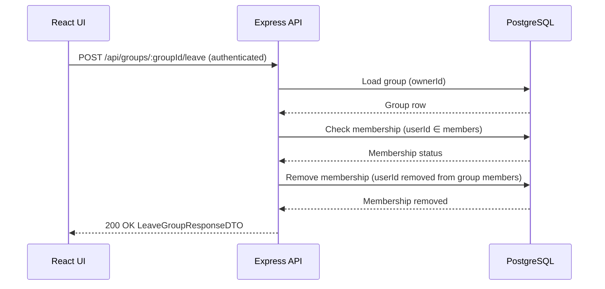

## POST /api/groups/{groupId}/leave

## Data Objecst
### Path Params
```ts
groupId: integer
```
### Auth Context
```ts
auth.userId: integer
```
### Database Group Row (minimum relied-upon fields)
```ts
id: integer
ownerId: integer
deletedAt: timestamp | null
```
### LeaveGroupResponseDTO (200 OK)
```ts
groupId: integer
userId: integer
leftAt: timestamp
```