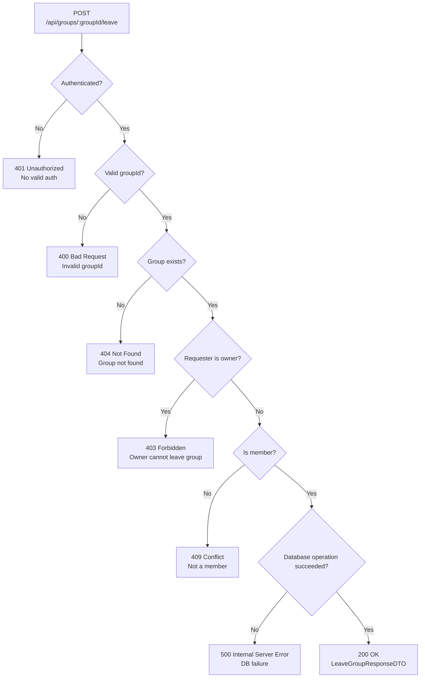

## POST /api/groups/{groupId}/leave – Error Flow

## Error Convention Responses
### 400 Bad Request
Returned when groupId is invalid.

### 401 Unauthorized
Returned when the request is not authenticated.

### 03 Forbidden
Returned when the requester is the group owner (owners cannot leave their own group).

### 404 Not Found
Returned when the group does not exist (or is deleted).

### 409 Conflict
Returned when the requester is not a member of the group.

### 500 Internal Server Error
Returned when a database operation fails.

### 200 OK
Returned on success. Response body: LeaveGroupResponseDTO.