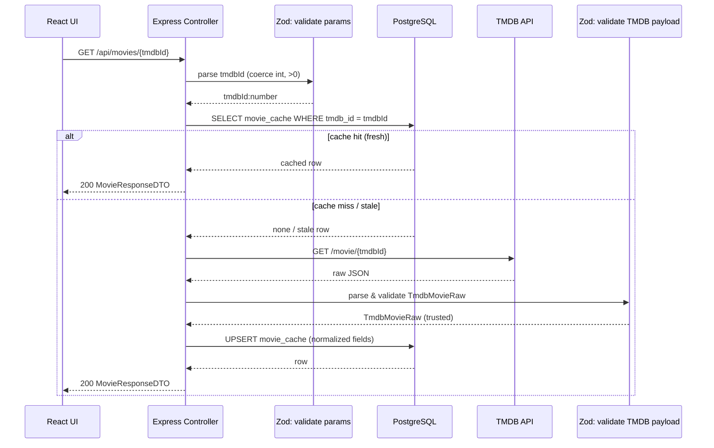

# Movie fetch - data flow


## Cache freshness rule
A cache row is considered fresh when:
```
- updated_at >= now() - 24h
```
If the row is missing, it is treated as a cache miss. 
If it exists but is older than the TTL, it is treated as stale and refreshed from TMDB.

## Data objects

### MovieIdParam
- tmdbId: number (int, >0)

### TmdbMovieRaw (external)
- id: number
- title: string
- overview: string | null
- poster_path: string | null
- backdrop_path: string | null
- release_date: string | null   (YYYY-MM-DD)
- runtime: number | null
- genres: Array<{ id: number; name: string }>

### MovieCacheRow (DB)
- tmdb_id: number (PK)
- title: string
- overview: string | null
- poster_url: string | null
- backdrop_url: string | null
- release_date: date | null
- runtime_minutes: number | null
- genres: string[]          (flattened)
- updated_at: timestamp

### MovieResponseDTO
- tmdbId: number
- title: string
- overview: string | null
- posterUrl: string | null
- backdropUrl: string | null
- releaseDate: string | null
- runtimeMinutes: number | null
- genres: string[]
