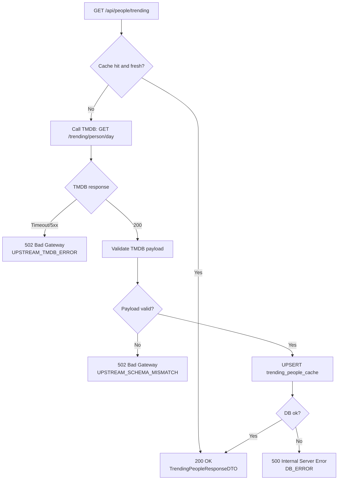

# People fetch – trending – error flows

## Error response conventions

All error responses follow the same structure:

- error: string (machine-readable)
- message: string (human-readable)
- details?: object (optional)

### 502 UPSTREAM_TMDB_ERROR
Returned when TMDB is unavailable, times out, or returns 5xx.

### 502 UPSTREAM_SCHEMA_MISMATCH
Returned when TMDB returns 200 but the payload does not match `TmdbTrendingPeopleRaw` schema.

### 500 DB_ERROR
Returned when database operations fail (select/upsert).
