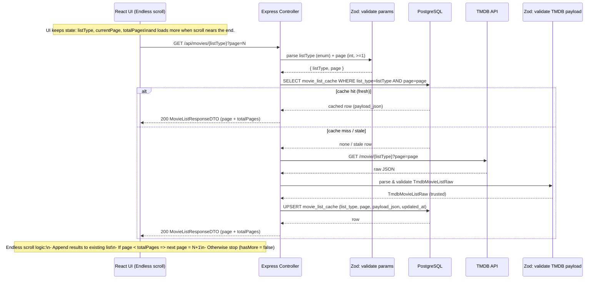

# Movie Lists – Paginated Data Flow (Endless Scrolling)



## Frontend Contract
```ts
- UI always requests `page=N` (starting from 1)
- `hasMore = page < totalPages`
- Next request uses `page + 1`
- Results are appended to the existing list
```
## DTO Requirements

### ListParams
```ts
- listType: "popular" | "top_rated" | "now_playing" | "upcoming"
- page: number (int, >=1)
```

### MovieListResponseDTO
```ts
- listType: string
- page: number
- results: MovieListItemDTO[]
- totalPages: number
- totalResults: number
```

## Cache
```ts
- Unique key: (list_type, page)
- payload_json contains one fully normalized page response
```