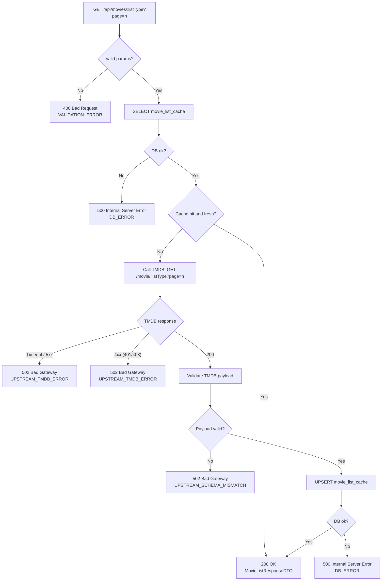

# Movie Lists – Error Flows

## Error Response Convention

All error responses share the same structure:

- error: string (machine-readable)
- message: string (human-readable)
- details?: object (optional)

### 400 VALIDATION_ERROR
Returned when `listType` is unsupported or `page` is not an integer >= 1.

### 502 UPSTREAM_TMDB_ERROR
Returned when TMDB is unavailable, times out, or responds with non-200 status (including 401/403/5xx).

### 502 UPSTREAM_SCHEMA_MISMATCH
Returned when TMDB responds with 200 but payload does not match `TmdbMovieListRaw`.

### 500 DB_ERROR
Returned when database operations fail (select or upsert).
