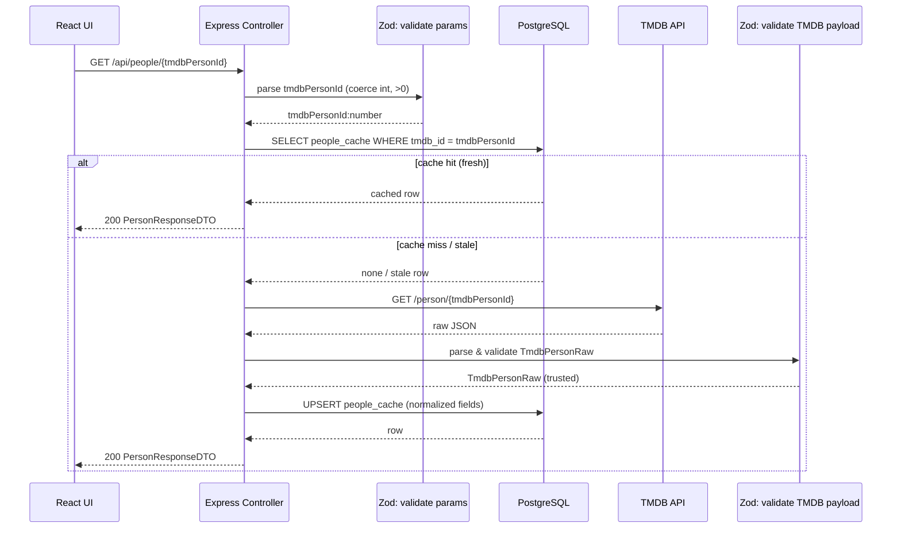

# People fetch – single person (data flow + spec)



## Cache freshness rule
A cache row is considered fresh when:
```
- updated_at >= now() - 24h
```
If the row is missing, it is treated as a cache miss.  
If it exists but is older than the TTL, it is treated as stale and refreshed from TMDB.

## Response conventions

### Success (200)
Returns:
- `PersonResponseDTO`

### Error (non-2xx)
Returns a consistent error envelope:
```ts
- status: number
- error: string
- message: string
- details?: unknown
```

Recommended error mapping:
- 400 VALIDATION_ERROR
- 404 PERSON_NOT_FOUND
- 502 UPSTREAM_TMDB_ERROR
- 502 UPSTREAM_SCHEMA_MISMATCH
- 500 DB_ERROR

## Data objects

### PersonIdParam
```ts
- tmdbPersonId: number (int, >0)
```

### TmdbPersonRaw (external)
```ts
Minimum fields to validate and use:
- id: number
- name: string
- biography: string | null
- profile_path: string | null
- known_for_department: string | null
- birthday: string | null            (YYYY-MM-DD)
- deathday: string | null            (YYYY-MM-DD)
- place_of_birth: string | null
```

### PeopleCacheRow (DB)
```ts
- tmdb_id: number (PK)
- name: string
- biography: string | null
- profile_url: string | null
- known_for_department: string | null
- birthday: date | null
- deathday: date | null
- place_of_birth: string | null
- updated_at: timestamp
```

### PersonResponseDTO
```ts
- tmdbPersonId: number
- name: string
- biography: string | null
- profileUrl: string | null
- knownForDepartment: string | null
- birthday: string | null
- deathday: string | null
- placeOfBirth: string | null
```

## Data transformations (raw → normalized → DTO)

### TMDB image path → absolute URL
- If `profile_path` is null → `profileUrl/profile_url = null`
- Else:
  - `profileUrl = TMDB_IMAGE_BASE + profile_path`
  - `profile_url = TMDB_IMAGE_BASE + profile_path`
Where `TMDB_IMAGE_BASE` is an env-configurable base like:
- `https://image.tmdb.org/t/p/w500`

### Field mapping
```ts
From `TmdbPersonRaw` to `PeopleCacheRow`:
- tmdb_id                ← id
- name                   ← name
- biography              ← biography
- profile_url            ← (image mapping)
- known_for_department   ← known_for_department
- birthday               ← birthday (YYYY-MM-DD → date) or null
- deathday               ← deathday (YYYY-MM-DD → date) or null
- place_of_birth         ← place_of_birth
- updated_at             ← now()

From `PeopleCacheRow` to `PersonResponseDTO`:
- tmdbPersonId           ← tmdb_id
- name                   ← name
- biography              ← biography
- profileUrl             ← profile_url
- knownForDepartment     ← known_for_department
- birthday               ← birthday (date → YYYY-MM-DD) or null
- deathday               ← deathday (date → YYYY-MM-DD) or null
- placeOfBirth           ← place_of_birth
```