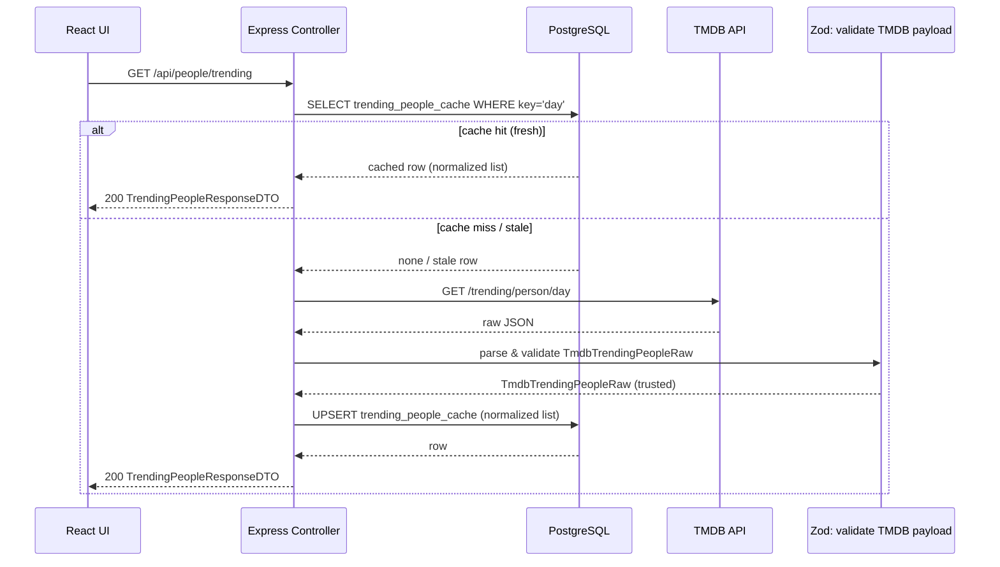

# People fetch – trending (data flow + spec)



## Cache freshness rule
A cache row is considered fresh when:
```
- updated_at >= now() - 24h
```
If the row is missing, it is treated as a cache miss.  
If it exists but is older than the TTL, it is treated as stale and refreshed from TMDB.

## Response conventions

### Success (200)
Returns:
- `TrendingPeopleResponseDTO`

### Error (non-2xx)
Returns a consistent error envelope:
- status: number
- error: string
- message: string
- details?: unknown

Recommended error mapping:
- 502 UPSTREAM_TMDB_ERROR
- 502 UPSTREAM_SCHEMA_MISMATCH
- 500 DB_ERROR

## Data objects

### TmdbTrendingPeopleRaw (external)
```ts
- page: number
- results: TmdbTrendingPersonItemRaw[]
- total_pages: number
- total_results: number
```

### TmdbTrendingPersonItemRaw (external)
```ts
Minimum fields to validate and use:
- id: number
- name: string
- profile_path: string | null
- known_for_department: string | null
- popularity: number | null
```

### TrendingPeopleCacheRow (DB)
```ts
- key: string (PK)         // e.g. "day"
- page: number
- total_pages: number
- total_results: number
- results: jsonb           // normalized TrendingPersonDTO[]
- updated_at: timestamp
```

### TrendingPersonDTO
```ts
- tmdbPersonId: number
- name: string
- profileUrl: string | null
- knownForDepartment: string | null
- popularity: number | null
```

### TrendingPeopleResponseDTO
```ts
- page: number
- results: TrendingPersonDTO[]
- totalPages: number
- totalResults: number
```
## Data transformations (raw → normalized → DTO)

### TMDB image path → absolute URL
For each result item:
- If `profile_path` is null → `profileUrl = null`
- Else `profileUrl = TMDB_IMAGE_BASE + profile_path`
Where `TMDB_IMAGE_BASE` is an env-configurable base like:
- `https://image.tmdb.org/t/p/w500`

### Field mapping
```ts
From `TmdbTrendingPeopleRaw` to `TrendingPeopleCacheRow`:
- key           ← "day"
- page          ← page
- total_pages   ← total_pages
- total_results ← total_results
- results       ← normalize `results[]` into `TrendingPersonDTO[]`
- updated_at    ← now()

Normalize each `TmdbTrendingPersonItemRaw` → `TrendingPersonDTO`:
- tmdbPersonId       ← id
- name               ← name
- profileUrl         ← (image mapping)
- knownForDepartment ← known_for_department
- popularity         ← popularity

From `TrendingPeopleCacheRow` to `TrendingPeopleResponseDTO`:
- page         ← page
- totalPages   ← total_pages
- totalResults ← total_results
- results      ← results
```