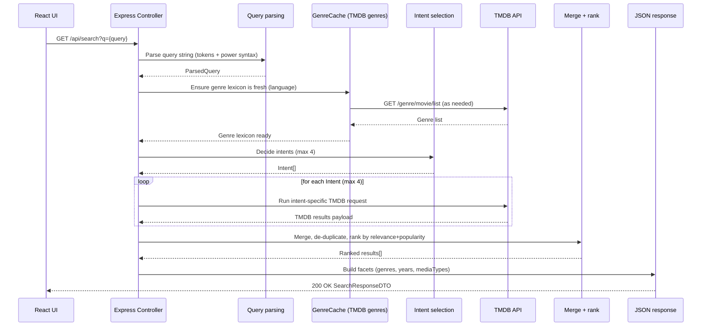

# Search – data flow (happy path)

## Data objects (spec-level)

### SearchRequest
- q: string (required, non-empty after trim)
  - Query string for free text search and “power syntax” tokens.

### PowerSyntax (inside `q`)
Tokens inside the same `q` string with format `key:value` are interpreted as search modifiers.
- lang: string (e.g. `fi-FI`)
- adult: boolean string (`true` | `false`)
- genre: string (genre name resolved via TMDB genre list)
- actor: string
- director: string
- keyword: string

### ParsedQuery
- raw: string                  (trimmed original q)
- tokens: string[]             (q split on whitespace, excluding key:value tokens)
- power: Record<string,string> (all key:value tokens, lowercased keys)
- year: number | [number, number] | undefined
  - Detected from query text:
    - single year like `1999`
    - range like `1999-2005`
- lang: string | undefined      (from power.lang)
- adult: boolean | undefined    (from power.adult)

### Intent
One query can produce multiple intents (max 4). Each intent maps to one upstream TMDB call.
- { kind: "genre", genreId: number }
- { kind: "person", name: string, role?: "actor" | "director" }
- { kind: "keyword", keyword: string }
- { kind: "collection", name: string }   (candidate intent)
- { kind: "title", title: string, year?: Year }
- { kind: "multi", query: string, year?: Year }

### SearchResponseDTO
- query: string                (echo of ParsedQuery.raw)
- intents: string[]             (intent kinds, e.g. ["title","multi"])
- count: number                 (results.length)
- facets:
  - genres: number[]            (unique genre ids found in results' `genre_ids`)
  - years: string[]             (unique YYYY from results' `release_date`, max 12)
  - mediaTypes: string[]        (unique `media_type` values; default "movie" if missing)
- results: TmdbResult[]         (merged + ranked; payload is largely TMDB-shaped)

### TmdbResult (minimum relied-upon fields)
The API does not validate/normalize TMDB payloads for this endpoint. Ranking/faceting relies on these fields when present:
- id: number
- media_type?: "movie" | "tv" | "person" | string
- title?: string                (movies)
- name?: string                 (tv/person)
- popularity?: number
- genre_ids?: number[]
- release_date?: string         (YYYY-MM-DD)
