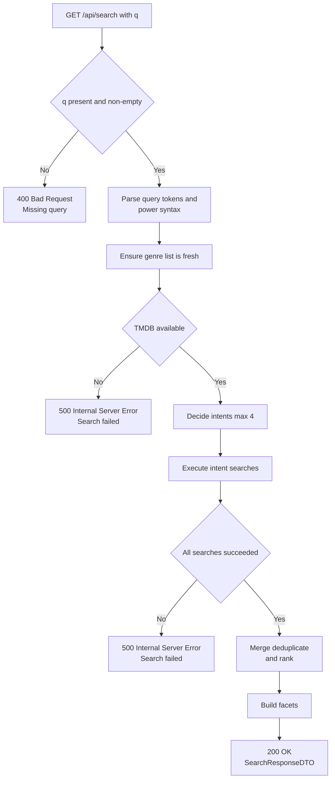

# Search – error flows

## Status codes & responses

### 200 OK
Returned on success.

Response body: `SearchResponseDTO`

### 400 Bad Request
Returned when `q` is missing or trims to an empty string.

Response body (current implementation):
- `"Missing query"` (JSON string)

### 500 Internal Server Error
Returned when any unexpected error occurs during processing, including upstream TMDB failures.

Response body (current implementation):
- `"Error with searching information"` (JSON string)
