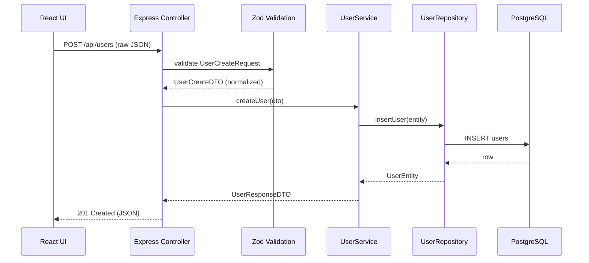

# User creation – data flow

## Data objects

### UserCreateRequest (raw input)
- email: string
- password: string
- username: string

### UserCreateDTO (validated)
- email: Email
- passwordHash: string
- username: Username

### UserEntity (domain)
- id: UserId
- email: Email
- username: Username
- createdAt: Date

### UserResponseDTO
- id: number
- email: string
- username: string
